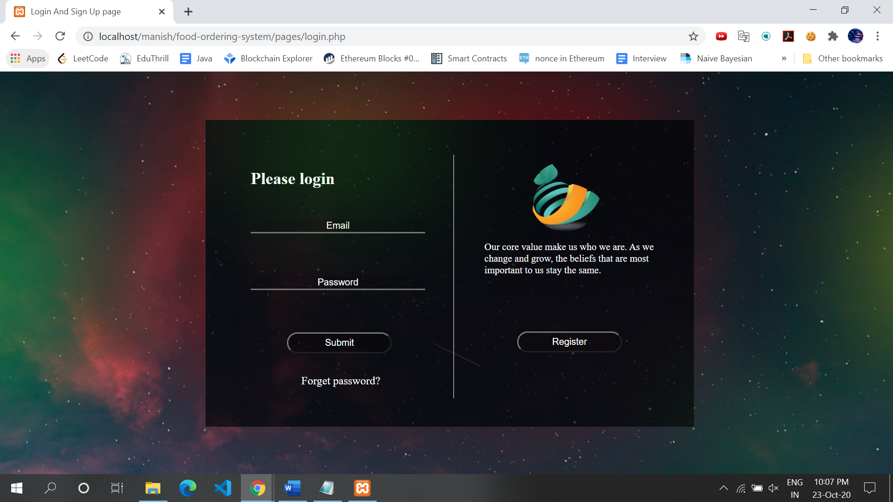
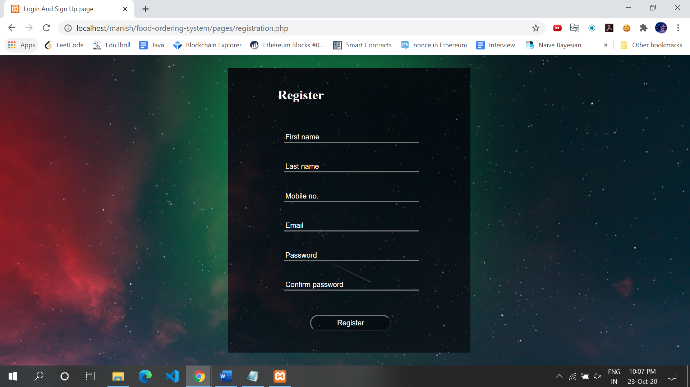
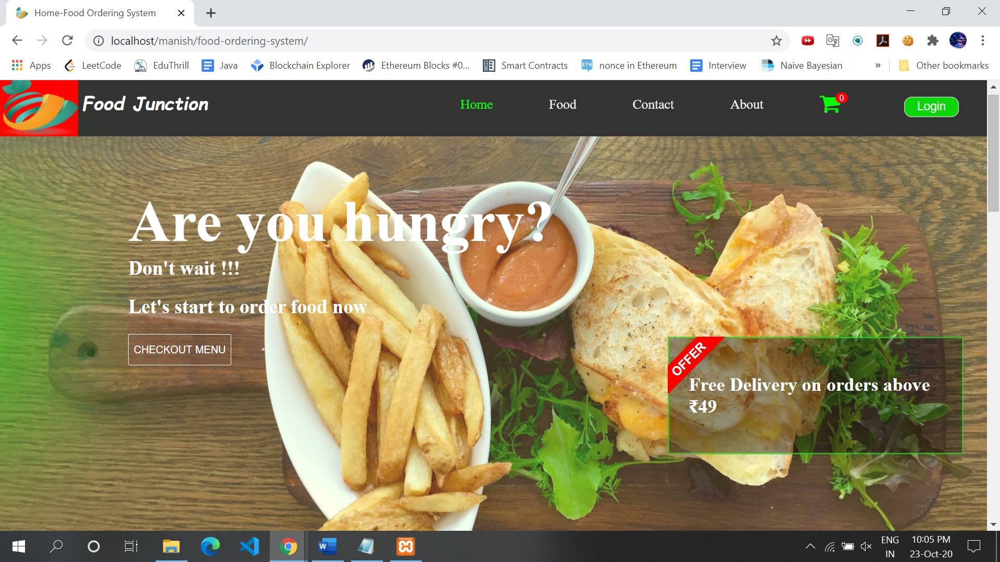
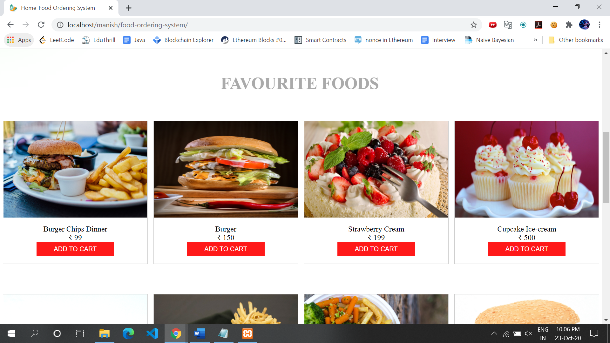
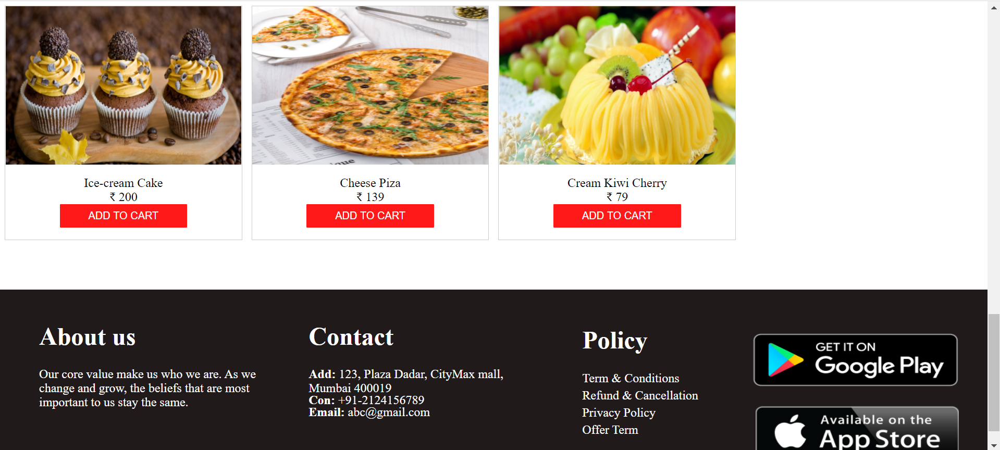
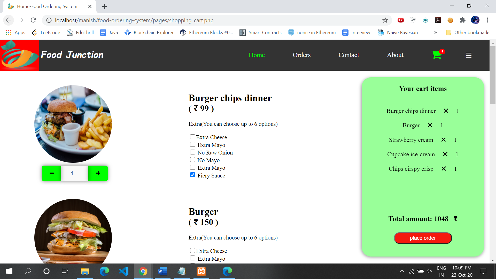
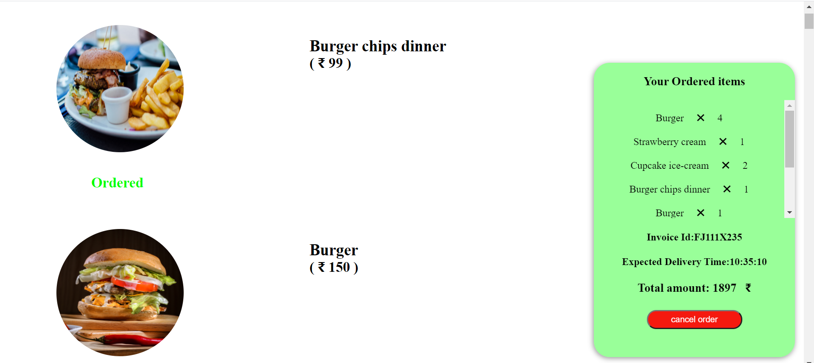
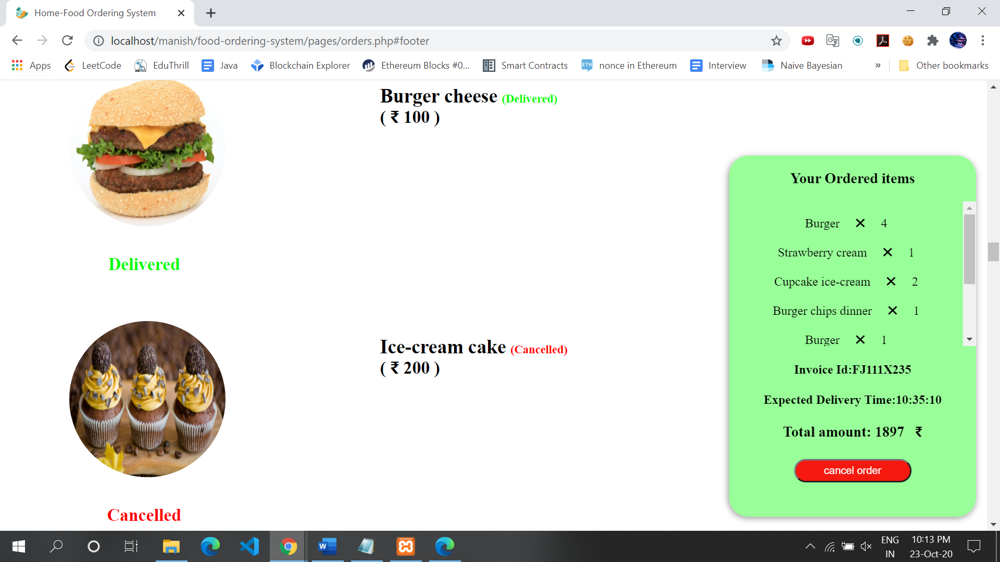
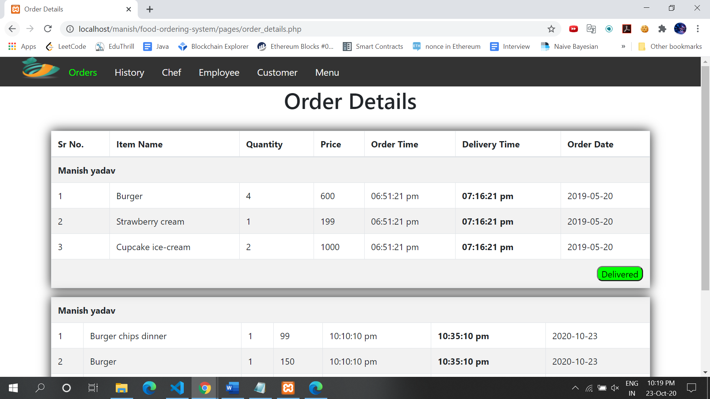

# Food Ordering System
> This system will allow hotels and restaurants to increase scope of business by reducing the labor cost involved, built and designed by meticulous strategy. It also allows to quickly and easily manage an attractive menu which customers can browse and use to place orders with just a few clicks.

## Table of contents
* [General info](#general-info)
* [Technologies](#technologies)
* [Functionality](#functionality)
* [Screenshots](#screenshots)

## General info
&nbsp;&nbsp;&nbsp;&nbsp;&nbsp;&nbsp;&nbsp;&nbsp;&nbsp;&nbsp;It is known globally that, in today’s market, it is extremely difficult to start a new small-scale
business and live-through the competition from the well-established and settled owners. In fast paced time
of today, when everyone is squeezed for time, the majority of people are finicky when it comes to placing a
food order. The customers of today are not only attracted because placing an order online is very
convenient but also because they have visibility into the items offered, price and extremely simplified
navigation for the order.\
&nbsp;&nbsp;&nbsp;&nbsp;&nbsp;&nbsp;&nbsp;&nbsp;&nbsp;&nbsp;Online ordering system greatly simplifies the ordering process for both
the customer and the restaurant. System presents an interactive and up-to-date menu with all available
options in an easy to use manner. Customer can choose one or more items to place an order which will land
in the Cart. Customer can view all the order details in the cart before checking out. At the end, customer
gets order confirmation details. Once the order is placed it is entered in the database and retrieved in pretty
much real time. This allows Restaurant Employees to quickly go through the orders as they are received
and process all orders efficiently and effectively with minimal delays and confusion.

## Technologies

* ```HTML```
* ```CSS```
* ```JavaScript```
* ```PHP```
* ```MySql```

## Functionalities
* Create an account.
* Manage their account.
* Log in to the system.
* Navigate the restaurant’s menu.
* Select an item from the menu.
* Add an item to their current order.
* Review their current order.
* Remove an item/remove all items from their current order.
* Place an order.
* Receive confirmation in the form of an order number.
* View order placed.

## Screenshots

#### Login Page

#### Registration Page

#### Home Page

#### Food Menu

#### Footer

#### Cart Items

#### Ordered Foods

#### Delivered and Canceled Foods

#### Order Details(For Manager)



